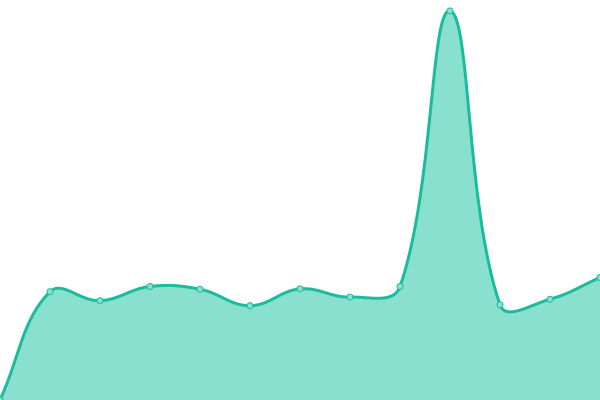
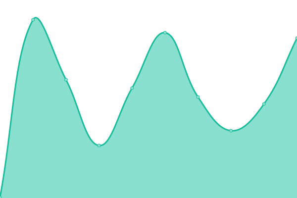
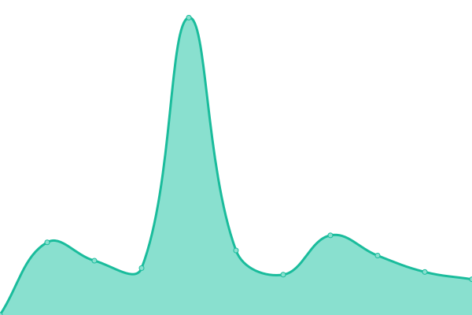
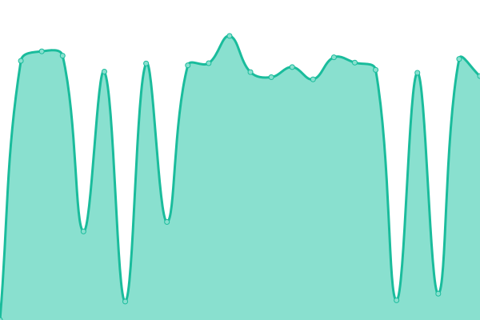
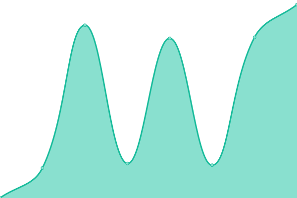

# [📈 Live Status](https://uptime.miantiao.me): <!--live status--> **🟩 All systems operational**

This repository contains the open-source uptime monitor and status page for [面条](https://mt.ci), powered by [Upptime](https://github.com/upptime/upptime).

With [Upptime](https://upptime.js.org), you can get your own unlimited and free uptime monitor and status page, powered entirely by a GitHub repository. We use [Issues](https://github.com/ccbikai/upptime/issues) as incident reports, [Actions](https://github.com/ccbikai/upptime/actions) as uptime monitors, and [Pages](https://uptime.miantiao.me) for the status page.

<!--start: status pages-->
<!-- This summary is generated by Upptime (https://github.com/upptime/upptime) -->
<!-- Do not edit this manually, your changes will be overwritten -->
<!-- prettier-ignore -->
| URL | Status | History | Response Time | Uptime |
| --- | ------ | ------- | ------------- | ------ |
|  [MT.CI](https://mt.ci) | 🟩 Up | [mt-ci.yml](https://github.com/ccbikai/upptime/commits/HEAD/history/mt-ci.yml) | 

 1427ms
     
 | 

<a href="https://uptime.miantiao.me/history/mt-ci">100.00%</a>
    

|  [MT.CD](https://mt.cd) | 🟩 Up | [mt-cd.yml](https://github.com/ccbikai/upptime/commits/HEAD/history/mt-cd.yml) | 

 433ms
     
 | 

<a href="https://uptime.miantiao.me/history/mt-cd">100.00%</a>
    

|  [Kai.Bi](https://kai.bi) | 🟩 Up | [kai-bi.yml](https://github.com/ccbikai/upptime/commits/HEAD/history/kai-bi.yml) | 

 1464ms
     
 | 

<a href="https://uptime.miantiao.me/history/kai-bi">100.00%</a>
    

|  [miantiao.me](https://miantiao.me) | 🟩 Up | [miantiao-me.yml](https://github.com/ccbikai/upptime/commits/HEAD/history/miantiao-me.yml) | 

 523ms
     
 | 

<a href="https://uptime.miantiao.me/history/miantiao-me">100.00%</a>
    

|  [s.mt.ci](https://s.mt.ci) | 🟩 Up | [s-mt-ci.yml](https://github.com/ccbikai/upptime/commits/HEAD/history/s-mt-ci.yml) | 

 224ms
     
 | 

<a href="https://uptime.miantiao.me/history/s-mt-ci">100.00%</a>
    

|  [chi.miantiao.me](https://chi.miantiao.me) | 🟩 Up | [chi-miantiao-me.yml](https://github.com/ccbikai/upptime/commits/HEAD/history/chi-miantiao-me.yml) | 

 1134ms
     
 | 

<a href="https://uptime.miantiao.me/history/chi-miantiao-me">100.00%</a>
    

|  [feed.miantiao.me](https://feed.miantiao.me) | 🟩 Up | [feed-miantiao-me.yml](https://github.com/ccbikai/upptime/commits/HEAD/history/feed-miantiao-me.yml) | 

 173ms
     
 | 

<a href="https://uptime.miantiao.me/history/feed-miantiao-me">100.00%</a>
    

|  [umm.miantiao.me](https://umm.miantiao.me/api/auth/verify) | 🟩 Up | [umm-miantiao-me.yml](https://github.com/ccbikai/upptime/commits/HEAD/history/umm-miantiao-me.yml) | 

 9782ms
     
 | 

<a href="https://uptime.miantiao.me/history/umm-miantiao-me">100.00%</a>
    

|  [uptime.miantiao.me](https://uptime.miantiao.me) | 🟩 Up | [uptime-miantiao-me.yml](https://github.com/ccbikai/upptime/commits/HEAD/history/uptime-miantiao-me.yml) | 

 174ms
     
 | 

<a href="https://uptime.miantiao.me/history/uptime-miantiao-me">100.00%</a>
    

|  [static.miantiao.me](https://static.miantiao.me/share/2024/k3g4qs/c3TrOQ.png) | 🟩 Up | [static-miantiao-me.yml](https://github.com/ccbikai/upptime/commits/HEAD/history/static-miantiao-me.yml) | 

 111ms
     
 | 

<a href="https://uptime.miantiao.me/history/static-miantiao-me">100.00%</a>
    

|  [waline.miantiao.me](https://waline.miantiao.me/ui) | 🟩 Up | [waline-miantiao-me.yml](https://github.com/ccbikai/upptime/commits/HEAD/history/waline-miantiao-me.yml) | 

 2315ms
     
 | 

<a href="https://uptime.miantiao.me/history/waline-miantiao-me">100.00%</a>
    

<!--end: status pages-->

[**Visit our status website →**](https://uptime.miantiao.me)

## 📄 License

- Powered by: [Upptime](https://github.com/upptime/upptime)
- Code: [MIT](./LICENSE) © [Anand Chowdhary](https://anandchowdhary.com), supported by [Pabio](https://pabio.com)
- Data in the `./history` directory: [Open Database License](https://opendatacommons.org/licenses/odbl/1-0/)
